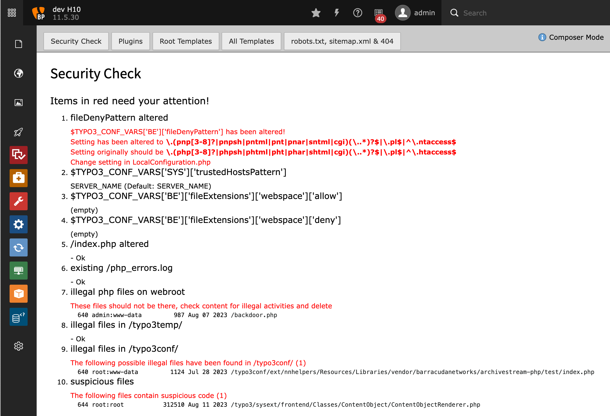
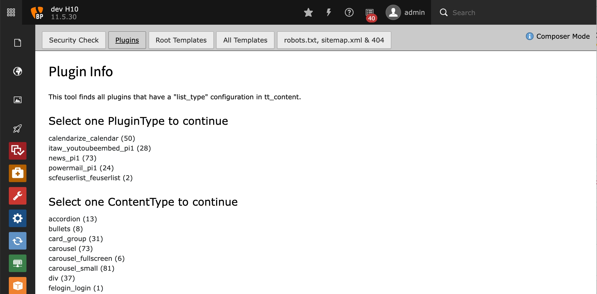
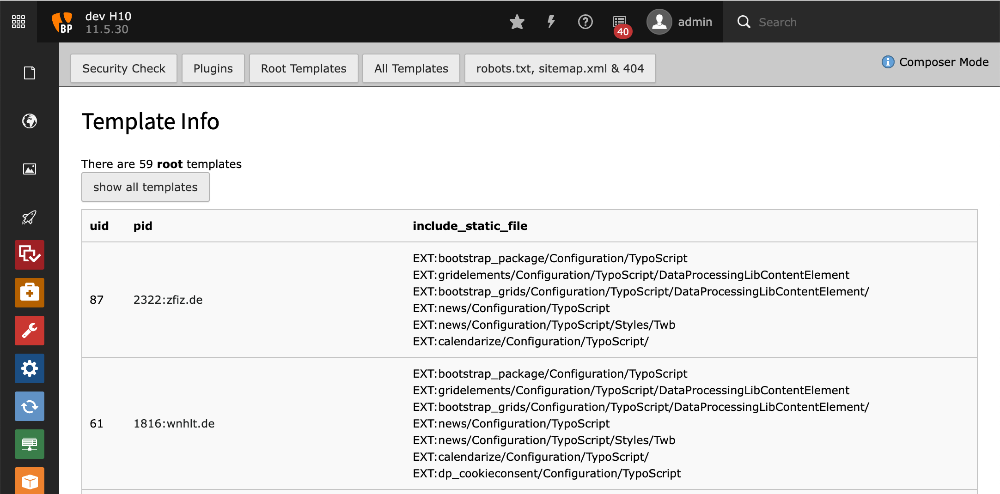

.. include:: ../Includes.txt

.. _introduction:

============
Introduction
============

Extension for Typo3 v10 + v11 + v12. Helpful for preparing migration or maintaining security of an installation.
Information on plugins used in pages, robots.txt, sitemap.xml and security checks.

"sysinfo" is meant as a start to think about easy security checks and migration support and is far from complete.

Other extensions that have me inspired (and I recommend to try):
- sypets/migrate2composer
- apen/additional_reports

What does it do?
================
In detail:
- security: check some settings and files that should not be there or are altered. The extension needs the shell commands "find" and "grep" to function.
- plugins: find content usng specific PluginType or ContentType and links directly to edit content
- root templates: find all and show what they include statically
- all template: as above + find alltemplates
- walk over all domains from site configuration and see f we can access robots.txt, sitemap.xml

What problems does it solve?
============================
- have I been hacked?
- does somebody uses my site to sell illegal drugs?
- where are all the plugins hidden, that I want to replace?
- which TS templates do I need to address for a rebuild of my site?

Who is the target audience?
============================
admins, system maintainers, migration consultants, security consultants

.. _screenshots:

Screenshots
===========

   Security Check

Some of the checks the extension processes

   Plugins

Find pages where plugins are used

   Templates

Find pages where templates are used

   Check domains

See if robots.txt, sitemap.xml and 404 are configured